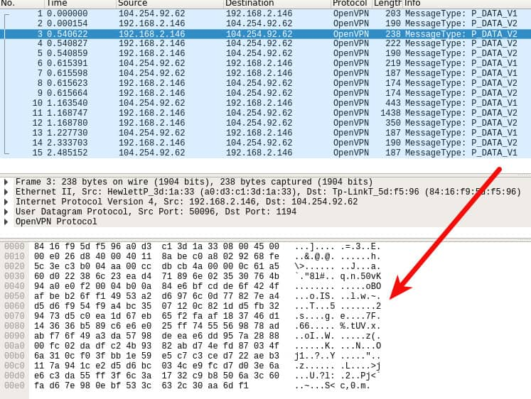
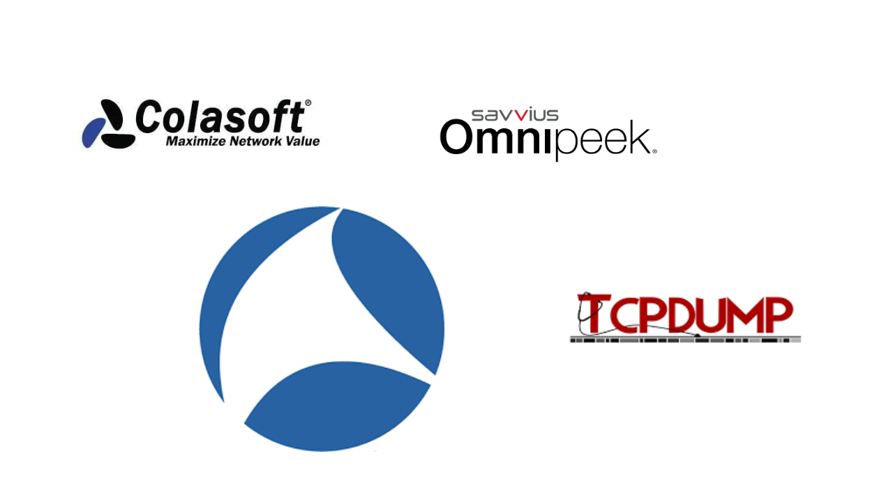

As most people know, the computer system uses the OSI model or TCP/IP model to communicate over the network. The OSI model consists of seven layers. The fifth layer called the network layer generates data packets for sending data through the network. Most network issues originate from this layer. In other words, most network problems stem from the packet level. Therefore, to better understand the network problems we need to be fully prepared with packet analysis knowledge. At the packet level, We can gain more information about the network. Because the packet level has not hidden anything. There are no secrets. We can do many things at the packet level such as control the network and solve problems. 

First, Let's talk about packet analysis. Packet analysis is the process of capturing and interpreting data which are flow over the network. And also packet analysis is used for understanding what is happening on the network. It is the simple idea of packet analysis. Normally, packet analysis is performed by packet sniffers which are capturing raw data that is going over the network. The packet sniffers helped us to gather much useful information about the network such as, 

Get an idea of what are the characteristics of the network.
Find out who is utilizing the network bandwidth.
Identify what are the peak times of the network.
Identify what are the possible attacks and malicious activities on the network.
Identify what are the unsecured applications running on the network.

When discussing packet sniffers, we have to break them down into two parts based on their license as commercial and free.  Paessler Packet Capture Tool, Omnipeek Network Protocol Analyzer, and ManageEngine NetFlow Analyzer are examples of commercial packet sniffing tools. Tcpdump and Wireshark are the most using free packet analyzers. Tcpdump is a more complicated command-line packet sniffing tool that is mostly used by professionals. Wireshark is the most popular free packet analyzer which is mostly used for network troubleshooting and communications protocol development. It has a graphical user interface. Therefore, users can easily interact with it. The original name of Wireshark is Ethereal. The Ethereal was renamed Wireshark in 2006 due to trademark issues.

Now, We are going to dive into how does work packet sniffers. As we talked about earlier, packet sniffing is gathering all or some packets that flow on the network. This process happens in three steps such as collection, conversion, and analysis. The first step of that process is the collection. The collection means gathering data that flows over the network. Normally, it is done by switching to promiscuous mode. After the previous step, our network interface card can capture all the traffic of the network. And second is conversion. In this step, the packet analyzer converts binary data captured from the first step to a human-readable format. Sometimes the conversion is the last step of some advanced packet sniffing tools. The last step is analysis. The packet sniffer takes all the captured data and classifies it based on their specific features like their protocol. Overall, this is the process that packet sniffers do. 

Lastly, let us clarify what factors we need to consider when we are selecting a packet sniffing tool. Most packet sniffers can interpret common network protocols like IPv4, ICMP, TCP, UDP, etc. But sometimes they are not supported for newer protocols like IPv6, SIP, etc. When you choose a packet analyzer you need to consider what are the supported protocols of that packet analyzer. Another factor is operating system support. If you are a professional, definitely you require to capture and analyze packets in different operating systems. Therefore, it is so important factor we need to consider. And also the cost is another factor to be considered. As we talked about earlier, packet sniffers are available for free and paid. The main difference between free and paid tools is their reporting engines. The paid tools are typically using better report-generation modules. The free tool has weak report generation modules or sometimes it has no such module.