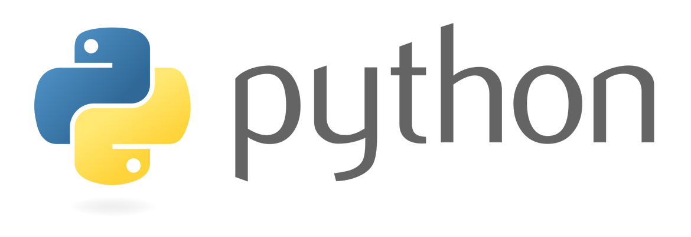
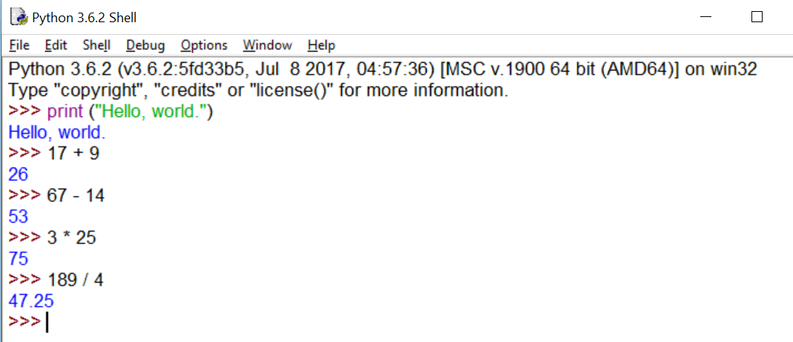
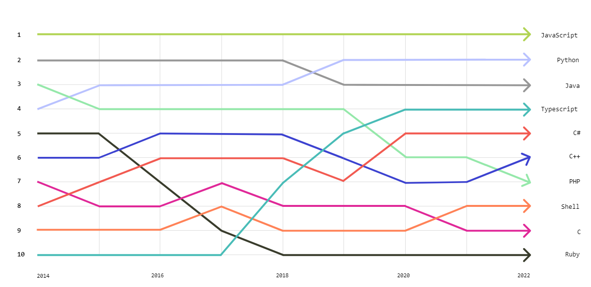

Now, we are going to talk about a very useful and popular topic among software developers. Python is our today’s topic. Python is a programming language that is simple and powerful in the technical world. As we know, Python is a high-level, interpreted, and general-purpose programming language. And also, Python is a beginner-friendly programming language. Because it has an easy-to-learn syntax and reduces the cost of program maintenance.  Python language is created by Guido Van Rossum in the late 1980s. Guido named his programming language after the British comedy group Monty python. he was a fan of that TV show. also, he wanted to his language be fun and memorable. Now, Python is frequently used in data science, web development, artificial intelligence, and scientific computing. And also, python is used for prototyping, scripting,  and automation. The wealth libraries and frameworks are built around Python for data science, ai, and web development. Programming has many paradigms such as procedural, object-oriented, Imperative programming, logic programming, and functional. Python supports multiple programming paradigms like procedural, object-oriented, and functional. Also, it has large standard libraries that provide many useful features such as file handling, networking, and regular expression.

As mentioned above, Python is an interpreted language. Python uses an interpreter to convert our code to machine code. The interpreter reads our code line by line and for each line, it checks syntax errors if there are no errors that line is converted to bytecode. After converting the whole file into bytecode, PVM(Python Virtual Machine) execute that bytecode and outputs the results. PVM is the runtime environment of the python language. Also, it provides a flexible and dynamic development environment.  It is responsible for managing memory, providing access to python standard libraries or installed third-party libraries or other packages, and executing bytecode instructions. That is the journey of the python code execution. And also, python gives an interactive mode. It is like a command interface.  We can enter the python code line and enter. Then, the python interpreter read it, executes it, and outputs the results. We can use interactive mode for doing experiments and testing out our ideas without having a complete python code.

As we know, python is a widely used programming language. According to the TIOBE index, python is the most popular programming language in the world. In march 2023, the python had a popularity rating of 14.83% up from 10.31%  in March 2022. The TIOBE index is an indicator of the popularity of the programming language. It tracks the popularity of the programming languages based on their search engine rankings. Python was the second most popular language for open-source projects on GitHub according to the Octoverse in 2022. There are python seconds only to Javascript. In addition, concerning universities and institutes worldwide, how much they add the python language to their computer science curriculum is the best indicator to measure the popularity of the python language. Now, Python is a part of their computer science curriculum.

Overall, python language is a fast-growing open-source programming language. Because its syntax is easy to understand and it can do the majority of tasks in today's industry. therefore most companies use python language for a wide range of applications from web apps to complex machine learning models. And also, Python is recommended for programming beginners. Beginners can easily understand programming concepts using python language. therefore python is popular among educators.

