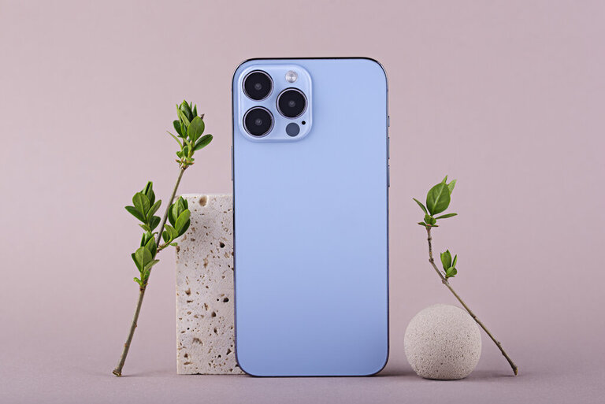

In the 21st century, we are passing the technological era. Technology is the most powerful weapon humans have. Technology is an applied method of knowledge that is used for achieving the goals of humans. Today, technology is used for different sectors like agriculture, transportation, health, etc. In the ancient eras, humans used manual methods to do their day-to-day activities. But, as of today humans mostly use technology to make their life easier. Wait a moment and think about your daily routine. You inevitably use smart devices in your day-to-day life. As of present, those have become an integral part of our life. A few decades ago we used cell phones. Primarily, they are used for calling and sending messages. But as of now, the cell phone has transformed into a gateway for the modern world. It can be used for taking high-resolution pictures, watching high-quality videos, browsing the internet, and playing interactive games. The amazing thing is how to handle all the above tasks in a small device.

The smartphone is only one little thing of the technological revolution. The technological revolution is a widely spread out topic. As technology grows day by day, Humans presented many concepts like space tourism, human-like robots, electric cars, self-driving cars, flying cars, gesture-based computing, wearable screens, nanobots, Li-fi, smart mirrors, etc.

When talking about the impacts of technology on our everyday life, we want to think about how changed our lives with technology. A few decades ago, humans communicated with others using letters, postcards, etc. But now they use sms, email, and messaging services to communicate with other people. It is a little example of how technology impacts our lives. To explain our topic we have more examples. Another one is transportation. our ancestors went on foot. Today we are using cars, buses or any other vehicles to transport. And also now humans are building self-driving cars, flying cars, and electric cars. These are not new. They are already on our roads. Tesla is one of the famous automotive companies that is building complex autopilot cars for the world car market.

Another one is artificial intelligence. Ai technology is the most improving sector of today’s modern world. Humans are still developing AI technology. It is a very impactable sector in our everyday life. You definitely use AI technology in your day-to-day life. Your smartphone is the best example of it. Google Assistant and Siri are popular AIs people use. Over the next two or three decades, humans will build human-like AI robots. They will definitely impact human life. In the future world, Artificial humans will live with us on earth. Therefore, Are artificial humans not impacting us?

Another one is artificial intelligence. Ai technology is the most improving sector of today’s modern world. Humans are still developing AI technology. It is a very impactable sector in our everyday life. You definitely use AI technology in your day-to-day life. Your smartphone is the best example of it. Google Assistant and Siri are popular AIs people use. Over the next two or three decades, humans will build human-like AI robots. They will definitely impact human life. In the future world, Artificial humans will live with us on earth. Therefore, Are artificial humans not impacting us?

> Images by rawpixel.com on Freepik