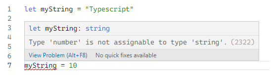
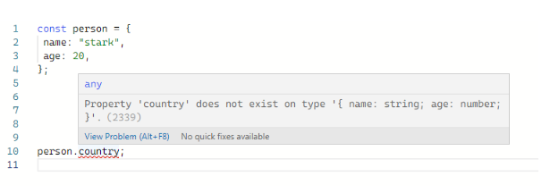
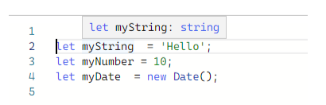

In this article, I will explain. what is typescript? Why do we need typescript for software development as a developer? And also what are the benefits of typescript? As of today, Javascript is a programming language that is indispensable for web development. Previously, Javascript is used for front-end web development. But, with the release of nodejs in 2009. We could use javascript for the backend. Now, Javascript is a full-stack programming language. However, javascript has a few issues. As everyone knows, Javascript is a dynamically typed language. Javascript has no type-safety. That means when you create a variable in javascript. You don’t need to mention what data type the variable is created on javascript. The javascript guesses the data type of the variable based on the value of the variable when it runs. I will explain it with a little example. See the javascript code block below.

```javascript
let myString = “Hello World!”; // declare a string variable
myString = 10;
```
In the above code block, you can see a variable called myString. myString variable is declared in the first line of the code which is a string-type variable. In the second line, the number 10 is assigned to the myString. You can assign any kind of data type to the myString variable. Therefore, Javascript has no type-safety. This is the main issue of Javascript. I hope you understood that.

Because of that issue, Microsoft released typescript in 2012. Simply, typescript is a superset of javascript. That means typescript is working for all the javascript syntax while adding new features to it. The typescript is responsible for type-checking. Typescript does type-checking when we are writing code and typescript throws exceptions when it is compiling. It is so helpful for reducing time for developers. Next, we will talk about some features of typescript.

## Static type-checking

We talked about type-checking earlier in this article. Now, we are going to deep dive into static type checking. All of us don’t like to see errors when our code is running. Therefore, we care to write code with fewer errors. When we run the code that is written us. If we see an error. Immediately, we try to isolate that and fix it. But, that is not every time. Just think you need to write large code. Now, can you do it as I mentioned earlier? It is not easy. Typescript comes to the playground at this moment. Typescript has a tool that helps to find bugs when we are coding. Static types system infers the behaviors of our values when our code is running. The tool of the typescript gets that information and tells us what the wrong with our code. Below, you can see an example such above.



## Non-exception Failures

Javascript has a specification called ECMAScript specification which is a set of instructions on how language should behave. ECMAScript has explicit instructions on how the language behaves when it runs in an unexpected way. For example, if trying to call something that is not callable. The language should throw an error. This does not happen always. See the code below.

```javascript
const user = {
 name: "Daniel",
 age: 26,
};
user.location; // returns undefined
```
In the above code, You can see it will not throw an error. It returns undefined. This is a crazy thing in javascript. But, in the typescript throw that as an error. Like below.



## Explicit Types

As we talked about earlier, typescript has type safety. When we declare a variable in typescript you can mention the variable is what kind of data type. Like below.

```javascript
let myString : string = “Hello”;
let myNumber : number = 10;
let myDate : Date = new Date();
```

You can put the colon after the variable name and write what data type. And also you can declare a variable without annotation. Then typescript infers the data type of the variable based on the value of the variable.



## Typescript installation

First of all, you need to install the latest nodejs on your pc. Then, you can enter a simple command below.

```javascript
npm install -g typescript
```

You can check typescript is successfully installed on your pc by entering the below command.

```javascript
tsc -v 
```

After, you can create a typescript file with the `.ts` extension. For example, `hello.ts`. Next, you want to run the below command to compile your typescript to javascript. Remember, you can’t run typescript on your web browser directly. You need to compile it into javascript.

```javascript
tsc hello.ts
```
Now, we came to the end of this article. In the next article, we can discuss typescript data types.

> Information by Typescript documentation